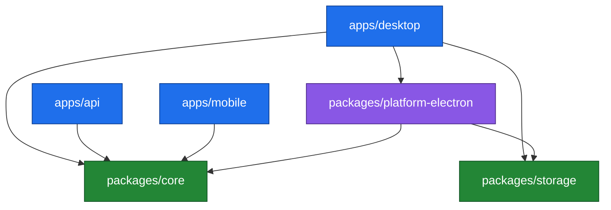

# Architecture & Dependency Boundaries

This monorepo is organized into **apps** (deployable products) and **packages**
(shared libraries). Dependencies may only point *downward* through the layers
below — never sideways between apps, and never upward from a package to an app.

## Layers & allowed dependency direction

| Layer | Package | May depend on | Must never depend on |
|------:|---------|---------------|----------------------|
| 2 — app | `@paycheck-planner/desktop` | core, storage, platform-electron | api, mobile |
| 2 — app | `@paycheck-planner/api` | core | desktop, mobile |
| 2 — app | `@paycheck-planner/mobile` | core | desktop, api |
| 1 — platform adapter | `@paycheck-planner/platform-electron` | storage, core | any app, React/UI |
| 0 — domain leaf | `@paycheck-planner/storage` | *(nothing internal)* | any other workspace package, Electron, React |
| 0 — domain leaf | `@paycheck-planner/core` | *(nothing internal)* | any other workspace package, Electron, React, browser globals |

Rule of thumb: **a package may depend only on packages in a strictly lower
layer.** Apps are all layer 2, so they can never depend on each other.

## Why these rules

- **`core` is pure domain logic** — financial calculations, currency, types. It
  must run identically on desktop, API, and mobile, so it cannot reach for
  Electron, React, the DOM, or any platform package.
- **`storage` defines contracts** (persistence/keychain interfaces, error types)
  that platform packages implement. It stays dependency-free so any platform can
  satisfy it.
- **`platform-electron` is an adapter** — it implements `storage` contracts using
  Electron APIs. It may use Electron, but never UI or app code.
- **Apps compose** core + the adapters they need. They are leaves of the import
  graph; nothing depends on an app.

## How the rules are enforced

Two complementary, automatic checks (both run in CI on every PR):

1. **Declared dependency direction + cycles** —
   [`scripts/check-workspace-deps.mjs`](../scripts/check-workspace-deps.mjs)
   reads every `package.json`, validates the layer rule above, and fails on any
   circular workspace dependency. Run locally with `pnpm check:boundaries`.
   Add new packages to its `LAYERS` map (an unclassified package is an error).
2. **Source-level import leaks** — per-package ESLint `no-restricted-imports` /
   `no-restricted-globals` rules block forbidden runtime imports, deep imports,
   and browser globals at the source level (e.g. `core` importing `react`).
   Run via the normal `lint` task.

## Blast radius

Shared packages (`core`, `storage`, `platform-electron`) and the guardrail files
(`scripts/`, `turbo.json`, workspace/TS/ESLint config) have the broadest blast
radius — changes there ripple into every app, so review them with extra care.

See [contributing.md](./contributing.md) for the workspace command quickstart and
how to scaffold a new package or app.
